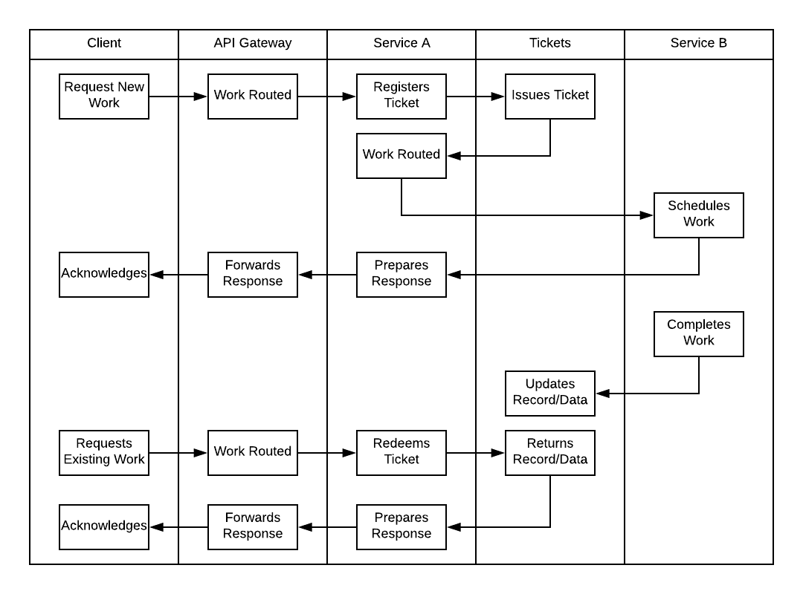

# Tickets
A lightweight HTTP service that facilitates issuing and redeeming tickets. Data
may also be associated and stored with ticket.


## Purpose
This service is meant to help facilitate asynchronous communication between
services. It acts as a proxy, where services may generate 'tickets', associate
data with them, and allow tickets to be queried and redeemed. It is
particularly useful in acting in place of a message BUS for very simple
workflows.

Example workflow. By using tickets service as a proxy, long running tasks can
be navigated synchronously, but unblocking.




## Technologies
This is a simple Python3 project:

- [tornado web framework](http://www.tornadoweb.org/en/stable/)
- [redis](https://redis.io/)

Dockerfile and Kubernetes service and pod files are included for _basic_
deployment.


## Documentation
Documentation is auto-generated using (Sphinx)[http://www.sphinx-doc.org/].

```
make -C documentation/ html
```

## Testing
Testing is performed with unittest and Mock. Tests are automatically run on PR
and weekly against `master` using [Travis CI](https://travis-ci.org/).

```
python -m unittest discover -p '*_tests.py' testing/unit
```
